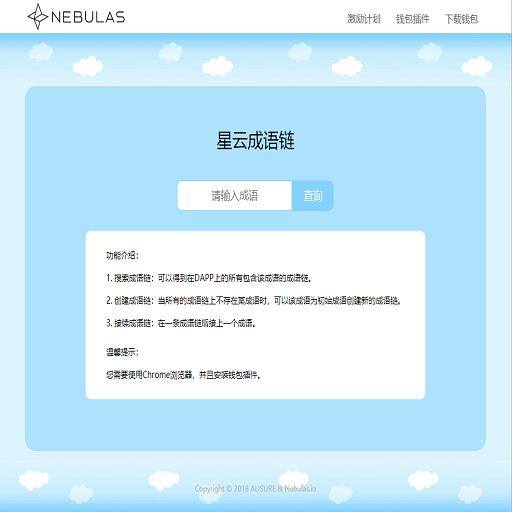

## DApp 名称
```
星云成语链
```

## 官网
[http://www.alisure.xyz](http://www.alisure.xyz)


## DApp 简介
```
Dapp名称：星云成语链
服务对象：全体星云用户
应用简介：星云成语链是第一款基于区块链的去中心化的成语接龙链，用户首先通过查询某个成语正式进入成语接龙。1.如果该成语在当前星云成语池中不存在，用户就可以用该成语创建自己的一条成语链，其他用户和自己都可以在该成语链上继续成语接龙。2.如果该成语在当前星云成语池中已经存在，就不能创建以它为首的成语链，当然如果该成语已经存在，会显示所有包含该成语的所有链。3。随着体验使用该星云链的用户数量的增多，成语池内的成语也会越来越多，创建成语链就会越困难。
应用展望：初次设计请大家批评指正，后序会更新应用设置NAS奖励机制，大家可以玩着赚钱。
```

## 合约使用说明
```
合约主要实现三个接口函数：
第一个是createIdiomChain函数，参数是一个成语，用于创建一条成语链，若创建成果则返回创建好的成语链，若不成功则抛出异常；
第二个是checkIdiomInChains函数，参数是一个成语，用于查询成语是否存在，存在返回true，不存在则返回false；
第三个是addIdiomToChain函数，参数是一个成语和成语链id，用于把成语接到对应成语链id的成语链上；
其他函数主要是为了实现以上三个函数的附属函数；
```

## 合约地址
```
n1kGtpre6WhFK48dDUSMMZxc1QyAjFzjFfj
```

## 合约哈希
```
c76dbe6cabc6d0fde56c9f93376c97d5df6714dba2f6d1d1ca297cae1c9a1179
```

## 宣传图




